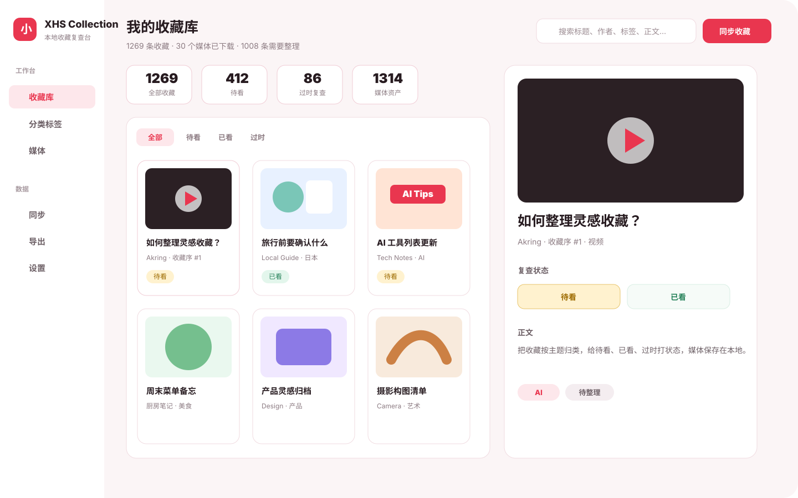
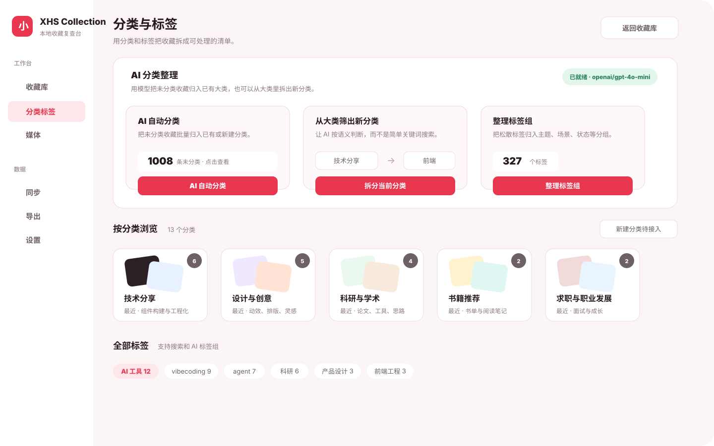

<p align="center">
  
</p>

<h1 align="center">XHS Collection</h1>

<p align="center">
  一个面向小红书收藏的本地优先桌面整理台。同步收藏、下载媒体、复查状态、分类标签和 AI 自动整理，都放在自己的电脑里。
</p>

<p align="center">
  <a href="https://github.com/Guesswhat-Studio/xhs-collection/actions/workflows/release.yml"></a>
  
  
  
</p>

> XHS Collection 是非官方工具，与小红书 / Rednote 没有关联。请只同步和下载你自己账号有权访问的内容，并遵守对应平台条款。

## Project Documents

- [Release Notes](RELEASE_NOTES.md)
- [Compliance And Responsible Use](COMPLIANCE.md)
- [MIT License](LICENSE)

## Preview





## Highlights

- **小红书收藏同步**：通过内置登录窗口读取本机登录态，按笔记 ID 去重，同步到本地 SQLite。
- **本地复查工作台**：收藏按最近收藏排序，支持待看、已看、过时、归档等状态。
- **分类和标签**：每条收藏有一个主分类，标签可承载多个横向维度；新分类输入后自动创建。
- **图片 / 视频管理**：媒体下载到系统对应的应用数据目录，收藏库和媒体库里可直接预览。
- **多本地账号**：本地账号绑定唯一小红书账号，后续同步会自动匹配账号。
- **AI 自动整理**：支持 OpenAI 兼容接口、Claude，以及 DeepSeek、硅基流动、通义千问、Kimi、MiniMax、智谱 GLM、腾讯混元、OpenRouter 和自定义端点。
- **AI 标签治理**：扫描无意义标签、按分类整理标签，并给出同义标签合并建议。
- **导出与备份**：收藏可导出为 JSON、CSV、Markdown，也可以生成包含 SQLite 和媒体文件的整库 Zip 备份。
- **诊断日志**：每次启动生成独立日志，退出时更新 `latest.log`，设置页可打开日志目录或清理历史日志。
- **跨平台桌面端**：Tauri v2 + React + Rust，目标平台包括 Windows、macOS Apple Silicon、Linux。

## Roadmap

- 稳定专辑 / 文件映射：继续校准小红书收藏页里的专辑、文件和本地分类/集合关系。
- 后台任务队列：覆盖详情补全和媒体下载，提供更清楚的并发控制、失败原因、批量重试和暂停恢复。
- 自动更新：基于 GitHub Releases 或自托管更新源发布新版本。
- 更细的隐私控制：截图脱敏、导出脱敏和可选加密本地数据库。

## Install

正式构建会发布在 [GitHub Releases](https://github.com/Guesswhat-Studio/xhs-collection/releases)。`v*` tag 会由 CI 自动构建：

- Windows x64：NSIS / MSI
- macOS Apple Silicon：`.app` / `.dmg`
- Linux x64：AppImage / deb / rpm

### 未签名版本安装提示

0.1.1 暂时按技术预览处理，安装包还没有做 Windows 代码签名和 macOS 公证。请优先从本项目的 GitHub Releases 下载，确认来源可信后再继续安装。

- **Windows**：浏览器下载时如果提示“此文件不常下载”或存在风险，请选择“保留” / “仍要保留”。首次运行时如果出现 Microsoft Defender SmartScreen 提示，可以点“更多信息”，再选择“仍要运行”。
- **macOS**：未签名或未公证的构建可能会被 Gatekeeper 拦截。安装后如果提示无法打开，可以先在 Finder 里右键 App 选择“打开”；如果仍被拦截，到“系统设置 > 隐私与安全性”里为 XHS Collection 选择“仍要打开”。熟悉终端的用户也可以执行 `xattr -dr com.apple.quarantine /Applications/XHS\ Collection.app` 后再打开。
- **Linux**：Linux 通常不会因为代码签名阻止运行。AppImage 下载后可能需要先赋予执行权限：`chmod +x XHS.Collection*.AppImage`，再双击或从终端运行。deb / rpm 包请使用系统包管理器安装，例如 `sudo apt install ./xhs-collection*.deb` 或 `sudo dnf install ./xhs-collection*.rpm`；如果提示依赖缺失，优先改用对应发行版的包格式或安装 Tauri/WebKitGTK 相关系统依赖。

## Development

环境要求：

- Node.js LTS
- Rust stable
- Tauri v2 系统依赖

```bash
npm ci
npm run tauri:dev
```

本地构建：

```bash
npm run build
npm run tauri:build
```

常用检查：

```bash
npm run build
cargo check --manifest-path src-tauri/Cargo.toml
```

### AI Prompt 修改

应用内可以直接修改 AI Prompt：打开 **设置 > AI Prompt**，选择要调整的任务，编辑 `System`、`User` / `Task`、`Rules` 或 JSON schema 后保存。保存后会写入本机应用数据目录下的 `prompts/ai.yaml`，后续 AI 调用会优先读取这个自定义文件，不需要重新编译应用。

内置默认 Prompt 放在 [`src-tauri/prompts/ai.yaml`](src-tauri/prompts/ai.yaml)，用于首次启动和“恢复默认”。当前包含：

- `test_connection`：AI 连接测试。
- `classify_uncategorized`：未分类收藏自动归类。
- `split_category`：从已有分类里筛出新分类。
- `group_tags`：标签分组。
- `tag_merge_suggestions`：标签去重和合并建议。

每个 prompt 的 `system`、`user`、`task`、`rules` 可以按需要修改；`output_schema` / `return_json_shape` 会被后端用于约束模型返回结构，字段名需要和 Rust 解析逻辑保持一致。设置页会校验 schema 必须是合法 JSON；如果手动编辑自定义 YAML 后格式错误，应用会回退到内置默认 Prompt，并在设置页显示错误。

开发者如果要修改内置默认值，可以编辑 [`src-tauri/prompts/ai.yaml`](src-tauri/prompts/ai.yaml)。这个文件会被编译进 Tauri 后端，修改内置默认值后需要重新运行或重新构建桌面端。

修改后建议至少跑：

```bash
cargo test --manifest-path src-tauri/Cargo.toml bundled_ai_prompts_load
cargo check --manifest-path src-tauri/Cargo.toml
```

## Release CI

`.github/workflows/release.yml` 会在 `main`、PR 和手动触发时构建三平台桌面包。推送 `v*` tag 时会创建 draft release 并上传产物。

```bash
git tag v0.1.1
git push origin v0.1.1
```

CI 平台矩阵：

- `windows-latest`
- `macos-15` with `--target aarch64-apple-darwin`
- `ubuntu-22.04`

## Privacy

- 收藏、分类、标签、媒体和同步记录默认保存在本机应用数据目录。
- 小红书登录 Cookie 优先保存在系统 Keychain / Credential Store；过期后需要重新登录。
- AI API Key 保存在本机安全存储；AI 分类时会把选中的收藏标题、正文摘要和标签发送到你配置的模型服务商。
- 项目不会内置第三方 API Key。

## Tech Stack

- Tauri v2
- Rust
- React 19
- TypeScript
- SQLite
- lucide-react
